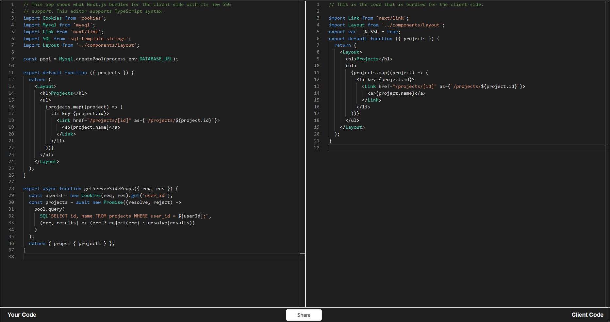

# [Written by 심재철](https://github.com/simsimjae)


# getStaticProps(Static Generation)

```js
export async function getStaticProps(context) {
  const { params, preview, previewData } = context;

  return {
    props: {}, // (필수) 페이지 컴포넌트의 props로 전달됨. serializable object여야한다.
    revalidate: // (선택) 몇 초 뒤에 페이지를 재생성할건지
  };
}
```

페이지 컴포넌트에서 이런 함수를 export해주면 빌드 타임에 HTML을 생성해준다.
이때 매개변수로 전달된 `context`에는 다음값들이 들어있다.

- `params` - 페이지의 라우팅과 관련된 값들이 들어있다. 만약 파일명이 `[id].js`고 라우팅이 `/1` 인 경우 params에는 `{ id: 1 }`이 들어있게된다.
- `preview` - 페이지가 preview모드인 경우 true다.
- `previewData` - `setPreviewData`함수에 의해 설정된 preview data를 포함한다.


getStaticProps는 클라이언트에서는 사용되지 않는다. 그래서 서버에서 사용되는 코드를 이 함수에 적어줄 수 있고 파일시스템이나 데이터베이스에도 접근할 수 있다.


# 간단한 예제

블로그를 만들때 `getStaticProps`를 활용할 수 있다.

```js
// 4. posts는 빌드 타임에 전달된 외부 데이터다.
function Blog({ posts }) {
  return (
    <ul>
      {posts.map((post) => (
        <li>{post.title}</li>
      ))}
    </ul>
  );
}

// 1. 빌드타임에 실행됨
export async function getStaticProps() {
  // 블로그 글을 불러오기 위해 API를 호출한다.
  const res = await fetch("https://.../posts");
  const posts = await res.json();

  // Blog Page Component에 받아온 데이터를 전달한다.
  return {
    props: {
      posts,
    },
  };
}

export default Blog;
```

## 언제 getStaticProps를 사용해야 하나요?

- 페이지를 빌드 타임에 미리 생성해도 괜찮은 경우 (꼭 유저의 요청이 없어도 미리 데이터를 구해올 수 있을때)
- Headless CMS로 부터 데이터를 가져올 때
- 데이터가 캐싱되어도 상관 없을 때
- 페이지가 매우 빠르게 렌더링 되어야 할때

**`getStaticProps`는 HTML과 JSON을 생성하기 때문에 CDN에 의해 캐싱되어 매우 빠릅니다.**

## 타입스크립트에서 getStaticProps 사용하기

```ts
import { GetStaticProps } from "next";

export const getStaticProps: GetStaticProps = async (context) => {
  // ...
};
```

`GetStaticProps` Type을 사용하면 된다.
만약 getStaticProps에서 리턴하는 Props의 타입을 추론해서 사용할 경우 `InferGetStaticPropsType`를 사용하라.

```ts
import { InferGetStaticPropsType } from "next";

// 5. 페이지 컴포넌트에서 받은 posts의 타입을 추론
function Blog({ posts }: InferGetStaticPropsType<typeof getStaticProps>) {
  // will resolve posts to type Post[]
}

type Post = {
  author: string;
  content: string;
};

// 1. 빌드타임에 실행
export const getStaticProps = async () => {
  // 2. Data Fetch
  const res = await fetch("https://.../posts");
  // 3. 받아온 데이터의 타입을 지정(Post[])
  const posts: Post[] = await res.json();

  return {
    props: {
      posts, // 4. 페이지 컴포넌트로 전달.
    },
  };
};

export default Blog;
```

```ts
import { InferGetStaticPropsType } from "next";
InferGetStaticPropsType<typeof getStaticProps>
```

이것을 사용하면 getStaticProps 함수가 리턴하는 값의 타입을 추론할 수 있다.


# 자동 HTML 페이지 재생성 (Incremental Static Regeneration)

```text
Next.js 9.5 이상 버전에서 적용됩니다.
```

`getStaticProps`을 사용하면 빌드 타임에 HTML을 미리 생성해둘 수 있다.

`Incremental Static Regeneration`는 데이터가 변경됬을때, 백그라운드에서 페이지를 재생성한다.

```js
// 1. 기본적으로 빌드타임에 처음 실행된다.
// revalidation이 활성화된 상태에서 새로운 요청이 들어왔을때
// serverless function에 의해 다시 실행될 수도 있다.
export async function getStaticProps() {
  const res = await fetch('https://.../posts')
  const posts = await res.json()

  return {
    props: {
      posts,
    },

    // 2. Next.js는 요청이 들어왔을때 
    // 초당 최대 1번 페이지를 재생성한다.
    revalidate: 1,
  }
}

export default Blog
```

이제 블로그의 글들은 1초에 한번씩 확인된다. 
만약 새로운 글이 추가 된다면 거의 즉시 `getStaticProps`가 재실행되어 새로운 페이지가 생성될것이다.

# 자동 페이지 재생성은 큰 규모의 앱에서도 잘 작동한다.
- 페이지가 지속적으로 빠르게 렌더링된다. (static HTML이기 때문에)
- 네트워크가 끊어져도 이전에 받아놓은 페이지를 보여줄 수 있다. (브라우저에 캐싱되기 때문에)
- 데이터베이스나 백엔드 서버에 요청을 조금만 보낸다. 모든 페이지는 한번에 재생성된다. (데이터가 업데이트 될때 딱 한번만 요청한다.)

# 파일을 읽을땐 process.cwd()를 사용하라.

`getStaticProps`에서 백엔드 API 호출 뿐 아니라 파일시스템에도 접근할 수 있다.
하지만 파일의 풀경로를 모두 입력해주어야한다.

Next.js가 프로젝트를 빌드할때 서로 다른 디렉토리에 있는 파일을 빌드하기 때문에 `__dirname`을 사용하면 오류가 난다.

대신에 `process.cwd()`를 사용하면 Next.js가 실행되고 있는 디렉토리를 가져올 수 있다.

```js
export async function getStaticProps() {
  const postsDirectory = path.join(process.cwd(), 'posts') // Next.js가 실행되고 있는 디렉토리 하위의 posts에 접근
  const filenames = fs.readdirSync(postsDirectory) // 그 아래에 있는 파일들을 모두 읽음.

  const posts = filenames.map((filename) => {
    const filePath = path.join(postsDirectory, filename)
    const fileContents = fs.readFileSync(filePath, 'utf8') 

    // 읽어온 파일을 가공해서 리턴한다.
    return {
      filename,
      content: fileContents,
    }
  })
}
```

# 기술적인 디테일한 내용들

## 빌드타임에만 실행된다.

`getStaticProps`가 빌드타임에 실행되기 때문에 유저의 요청이 있어야만 하는 아래 속성들은 사용이 불가능하다. 

1. request객체의 query
2. HTTP headers의 속성들

## 서버코드를 직접 작성하라.
`getStaticProps`는 오직 서버에서만 실행된다. 클라이언트에서는 절대 실행되지 않는다. 
`getStaticProps`는 번들에 포함되지 않기 때문에 [브라우저로도 내려가지 않는다.](https://next-code-elimination.now.sh/)
`getServerSideProps`도 마찬가지이다.



왼쪽이 원래 코드고 오른쪽은 클라이언트에 번들로 내려간 코드이다.
`getServerSideProps`가 제거된 걸 확인할 수 있다.

## HTML과 JSON을 정적으로 생성한다.

빌드타임에 `getStaticProps`가 실행되면 Next.js는

1. 페이지 컴포넌트를 HTML로 만들고
2. `getStaticProps`에서 리턴된 값을 JSON파일로 만든다.

이 JSON은 클라이언트에서 라우팅을 할때 사용된다.(next/link, next/router)

**미리 렌더링된 페이지를 클라이언트 라우팅으로 접근하게 될 경우 Next.js는 2번에서 만든 JSON파일을 가져와서 페이지 컴포넌트의 Props로 사용한다.**
이 경우에도 마찬가지로 `getStaticProps`는 클라이언트에서 실행되지 않는다. `getStaticProps`에 의해 미리 만들어진 JSON 파일을 활용할 뿐이다.
`getStaticProps`는 오직 빌드타임에만 실행된다는 걸 명심하자.

## 페이지 컴포넌트에서만 사용할 수 있다.

`getStaticProps`는 페이지 컴포넌트에서만 export되어야 한다.

페이지가 렌더링되기 전에 데이터가 모두 준비되어야만 리액트가 제대로 렌더링 될 수 있기 때문이다.

## 개발모드에서는 모든 요청에 의해 실행된다.

`next dev`를 통해 next.js를 개발모드에서 실행하게 되면 `getStaticProps`는 모든 요청에 의해 실행된다.
위에서 빌드 타임에만 실행된다고 한것은 production모드일때 그렇다는 말이다.

## Preview Mode
프리뷰 모드는 고급 기능이므로 이 [링크를 참고하라.](AdvancedFeatures/PreviewMode.md)
